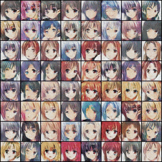
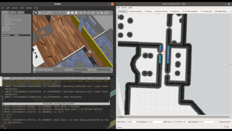
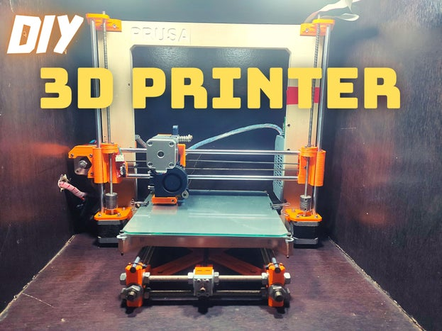
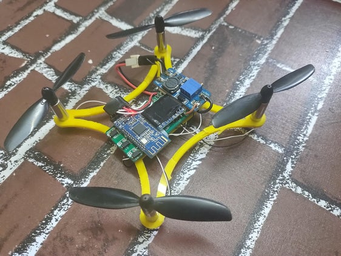

<!--My Intro-->

<h3>Hi there , I am Jovian 👨‍🏭, and I teach robots 🤖 how to learn 🧠, I love to automate tasks using Robots and AI. </h3>

# 😎 About Me

- 💻 I'm a Full Stack 🤖 Robotics Engineer. 
- 👷‍♂️ Working part time with a startup ⭐ [SkylarkLabs.ai](https://skylarklabs.ai/), where I recently developed fast and efficient video classifier.
- 🌱 I’m currently learning about **Generative Advesarial Networks** 
- 👯 I’m looking to collaborate on 🧠 ML/AI, 🤖 __ROS__, 💡Robotics project.
- 💬 Ask me about: Robotics, Machine Learning, Drones, 3D Printing Microcontrollers.
- 🌐 You can check out my [Personal Website](https://jovian-dsouza.github.io/)
- ▶️ I'm the creator of [JoviTech](https://www.youtube.com/Jovi_tech/?sub_confirmation=1) Youtube channel, where I showcase my inventions in a easy to understand manner.

<!-- # 💗 Things I love -->

<!-- # 👨🏻‍🏫Technical Skills

|<h3>🤖 Machine Learning / Deep Learning</h3>|<h3>Robotics</h3>|<h3>infrastructure</h3>|
|--|--|--|
|
<a href="http://pytorch.org/"><code></code></a>
<a href="https://www.tensorflow.org/"><code></code></a>
<a href="https://opencv.org/"><code></code></a>
<a href="https://scikit-learn.org/stable/"><code></code></a>
<a href="https://matplotlib.org/"><code></code></a>|</a>| -->

# 📝 Written Articles

- 🖨️ [DIY 3D Printer | Prusa I3 3D Printer Clone](https://www.instructables.com/DIY-3D-Printer-Prusa-I3-3D-Printer-Clone/)
- 🛩️ [Cheap Arduino Drone Using Bluetooth](https://www.instructables.com/Cheap-Arduino-Drone-Using-Bluetooth/)

# 🔨 Projects

<table align="center">
 <tr>
    <th>Violence Detection</th> <th>Anime GAN</th>
 </tr>
 <tr>
    <td></td>
    <td></td>
 </tr>
</table>

<table align="center">
 <tr>
    <th>ROS Perception, Planning and Navigation</th>
 </tr>
 <tr>
    <td></td>
 </tr>
</table>

<table align="center">
 <tr>
    <th>3D Printer</th> <th>Drone</th>
 </tr>
 <tr>
    <td></td>
    <td></td>
 </tr>
</table>

# 📈 Profile Stats

 <!--style="max-width:500px;"-->
  

  <!--Mostly Used Languages-->
  <!--  -->

