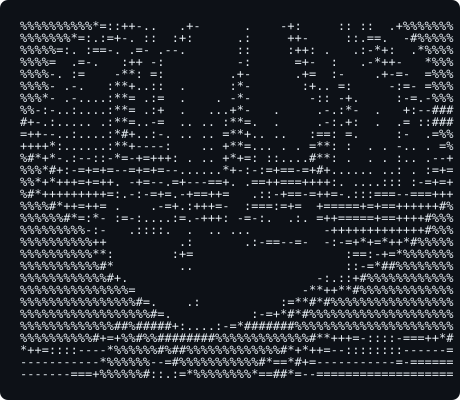
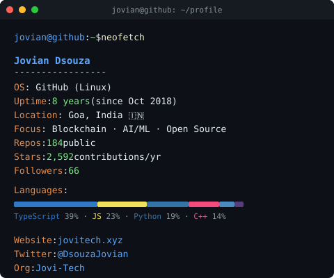

<!-- hero: ASCII portrait + neofetch card, terminal-style -->

<h3><code>jovian@github ~ $ whoami</code></h3>

<table>
<tr>
<td valign="top"></td>
<td valign="top"></td>
</tr>
</table>

 
 

<!-- animated contribution graph: real data, cells reveal with stagger animation -->

<h3><code>jovian@github ~ $ ./contributions.sh</code></h3>

 
 

<h3><code>jovian@github ~ $ ./links.sh</code></h3>

<b>Blockchain Developer · AI/ML Engineer · Open-Source Contributor</b>

 

<!-- Tech stack -->

<h3><code>jovian@github ~ $ cat stack.json</code></h3>

<table>
<tr>
<td valign="top" width="50%">

#### Languages

</td>
<td valign="top" width="50%">

#### Focus Areas

- 🔗 **Blockchain** - Smart Contracts, DeFi, DApps, MPC
- 🤖 **AI/ML** - AI Agents, Open Source AI tools
- 🔐 **Web3** - Threshold signatures, Chain abstraction
- 🌟 **Open Source** - Contributing to AI + fintech repos

</td>
</tr>
</table>

 

<!-- Stats -->

<h3><code>jovian@github ~ $ ./stats.sh</code></h3>

 
 

---

<!-- Auto-refreshed by .github/workflows/update-profile-art.yml -->
