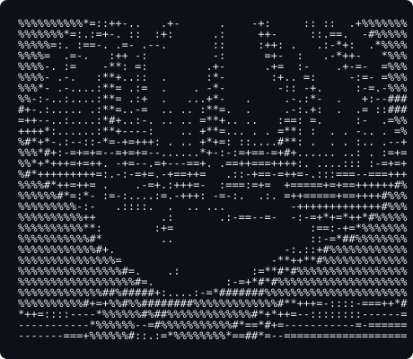
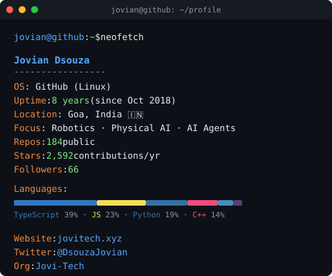

<!-- hero: ASCII portrait + neofetch card, terminal-style -->

<h3><code>jovian@github ~ $ whoami</code></h3>

<table>
<tr>
<td valign="top"></td>
<td valign="top"></td>
</tr>
</table>

 
 

<!-- animated contribution graph: real data, cells reveal with stagger animation -->

<h3><code>jovian@github ~ $ ./contributions.sh</code></h3>

 
 

<h3><code>jovian@github ~ $ ./links.sh</code></h3>

<b>Physical AI · Robotics · On-Device Perception</b>

 

<!-- Tech stack -->

<h3><code>jovian@github ~ $ cat stack.json</code></h3>

<table>
<tr>
<td valign="top" width="50%">

#### Stack

</td>
<td valign="top" width="50%">

#### Focus Areas

- 🦾 **Robotics** - Manipulation, control, and hardware-in-the-loop
- 🌍 **World Models** - Learned dynamics for prediction and planning
- 🤖 **Real Robot Arm** - Motion and closed-loop control on physical arms
- 📷 **Edge Perception** - On-device vision, camera ML, screen understanding
- 🔧 **Embedded Hardware** - Raspberry Pi, NFC, touch displays, sensor I/O

</td>
</tr>
</table>

 

 

---

<!-- Auto-refreshed by .github/workflows/update-profile-art.yml -->
