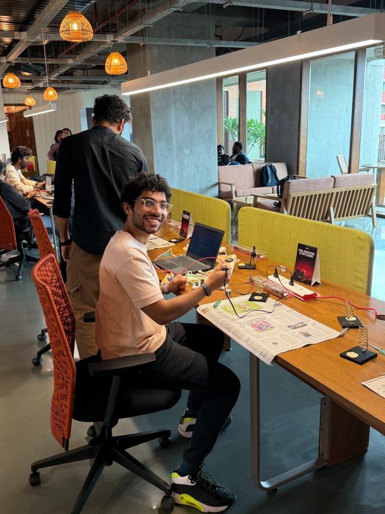
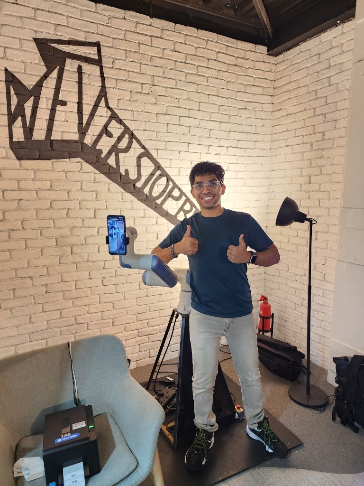
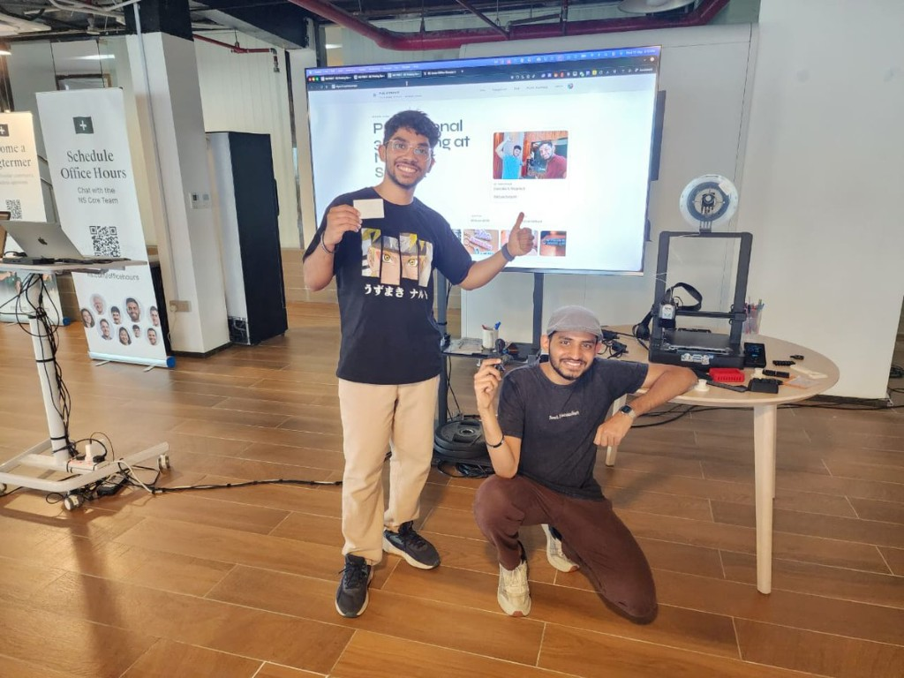
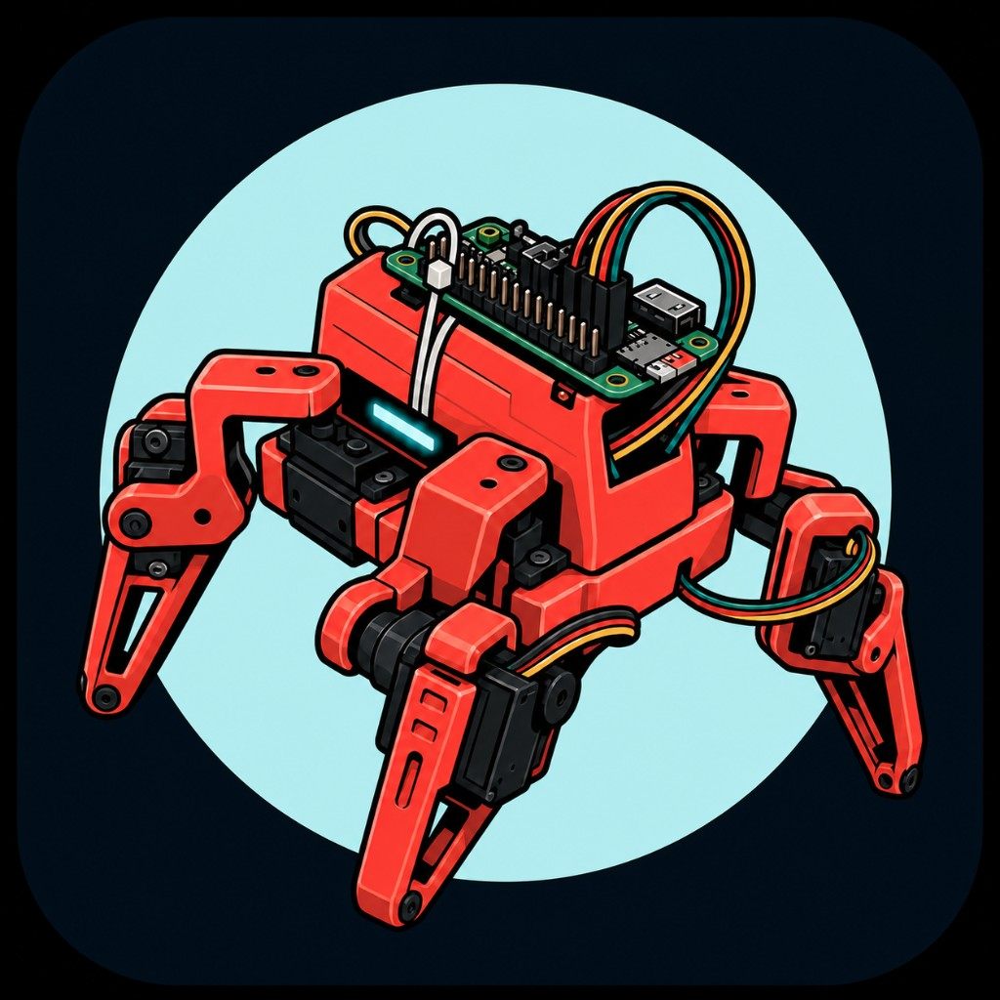

### `jovian@github ~ $ whoami`

|                                                       |                                                            |
| ----------------------------------------------------- | ---------------------------------------------------------- |
|  |  |

### `jovian@github ~ $ ./contributions.sh`

### `jovian@github ~ $ ./links.sh`

### `jovian@github ~ $ cat stack.json`

#### Stack

#### Focus Areas

- 🦾 **Robotics** - Manipulation, control, and hardware-in-the-loop
- 🌍 **World Models** - Learned dynamics for prediction and planning
- 🤖 **Real Robot Arm** - Motion and closed-loop control on physical arms
- 📷 **Edge Perception** - On-device vision, camera ML, screen understanding
- 🔧 **Embedded Hardware** - Raspberry Pi, touch displays, sensor, motors, on device ai

### `jovian@github ~ $ ls ./field/`

|                                                                                                              |                                                                                                                |
| ------------------------------------------------------------------------------------------------------------ | -------------------------------------------------------------------------------------------------------------- |
|  Hardware hackathon Mentor    |  Robotic arm for onboarding to event |
|  Network School Workshop |  Molty.pet                    |

---

